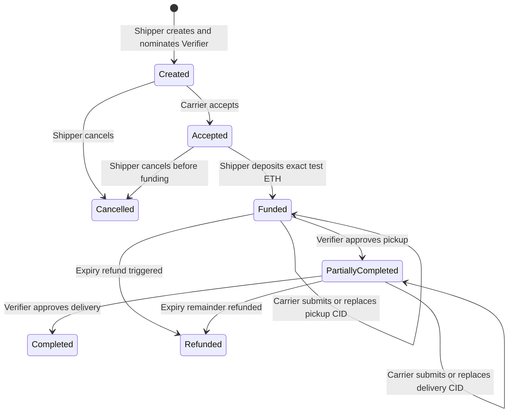
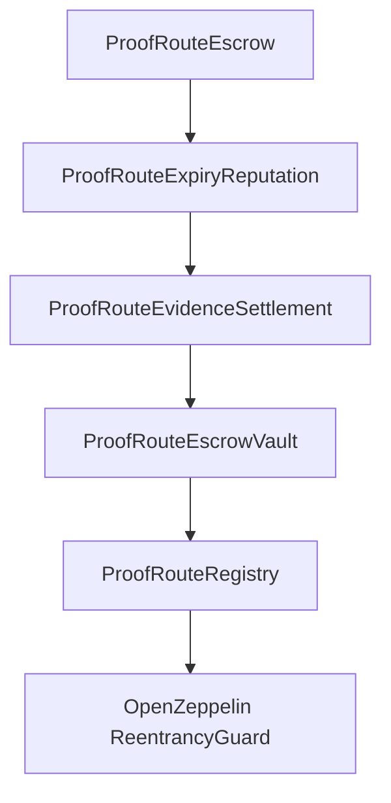

# ProofRoute Business Rules and Architecture

## Lifecycle rules

1. A wallet registers once as Shipper, Carrier, or Verifier. Its wallet address is its identity.
2. Only a registered Shipper creates an agreement. The selected Carrier and Verifier must already have their matching roles, and all three addresses must differ.
3. An agreement records cargo, route, exact test-ETH escrow, deadline, payout split, two nonzero and distinct proof hashes, and the nominated Verifier.
4. Only the nominated Carrier may accept. Only the Shipper may fund, and the deposit must exactly equal the agreed escrow before the deadline.
5. The Shipper may cancel only while the agreement is unfunded (`Created` or `Accepted`). Direct Ether transfers are rejected.
6. For the active milestone, only the Carrier may submit an evidence CID. It must contain 1 to 128 characters. The interface performs stricter CIDv0/CIDv1 validation.
7. The Carrier may replace the active milestone CID before approval and before expiry.
8. Only the nominated Verifier may approve. Evidence must already exist, the one-time code must match its stored hash, pickup must precede delivery, and neither milestone may be approved twice.
9. Pickup releases `required escrow × pickup basis points ÷ 10,000`. Delivery releases every unreleased wei, including integer-division remainder.
10. Approval and reputation state update before the Carrier transfer. Transfer failure rolls the transaction back atomically, and payout/refund entry points are reentrancy-protected.
11. After expiry, evidence submission and approval are blocked. Any wallet may call `processExpiredAgreement`; the unreleased balance always returns to the Shipper.
12. A funded expiry increments the Carrier's funded-expiry counter once. Successful approvals increment verified milestones, and successful delivery increments completed agreements. No subjective score is calculated.
13. Events record agreement creation, Verifier nomination, acceptance, funding, evidence submission or replacement, approval, payout, completion, cancellation, and refund.

## Lifecycle

## Contract modules

- `ProofRouteRegistry`: roles, users, agreements, milestones, nominated Verifier, participant indexes, acceptance and getters.
- `ProofRouteEscrowVault`: exact funding and direct-transfer rejection.
- `ProofRouteEvidenceSettlement`: Carrier evidence, Verifier approval, proof hashes, progressive payouts and success counters.
- `ProofRouteExpiryReputation`: cancellation, expiry refunds and funded-expiry counters.
- `ProofRouteEscrow`: deployable composition contract; the frontend uses its combined ABI.

There is no database, conventional backend, token, NFT, DAO, proxy, or external oracle. The deployed contract is the shared source of truth. Photos are uploaded separately to IPFS and only their CIDs are saved on-chain.

## Security and limitations

- IPFS proves that retrieved bytes match a CID; it does not prove when, where, or truthfully why a photo was taken.
- Evidence and transaction input are public. Proof codes become visible when a Verifier approves, so codes are single-use demonstration secrets.
- The app never stores proof codes in local storage, source code, URLs, logs, or analytics.
- Do not upload faces, patient records, home addresses, or other sensitive information. Use staged dummy evidence.
- Solidity cannot schedule its own refund; a wallet must submit the expiry transaction after the deadline.
- The event history queries local-chain logs directly and is not a production-scale indexer.
- Local Hardhat accounts and test ETH have no real-world value.
- Disputes are intentionally deferred because they require explicit freezing, resolution-authority, and payout rules.
