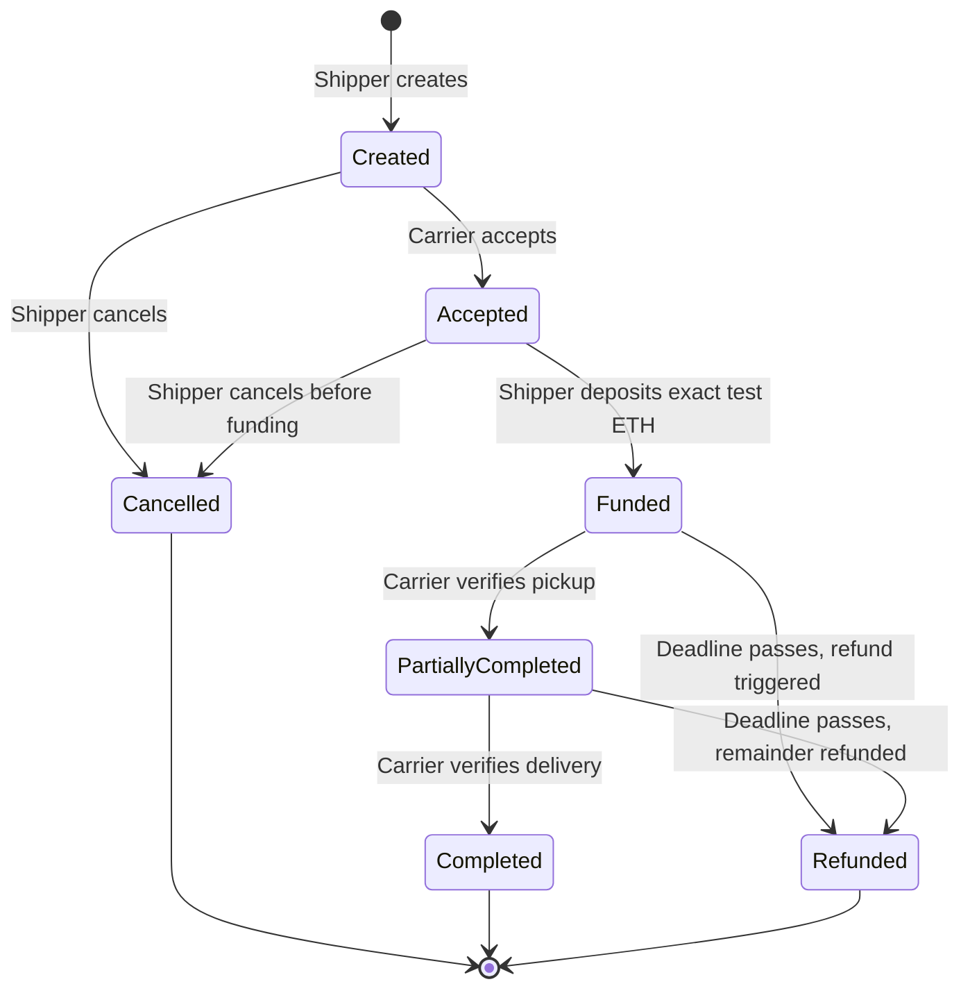
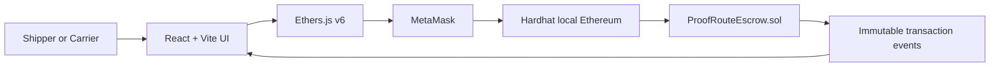

# ProofRoute Business Rules and Architecture

## Complete lifecycle rules

1. A wallet registers once as either Shipper or Carrier. The wallet address is its identity.
2. Only a Shipper creates an agreement, and the nominated Carrier must already be registered.
3. An agreement records cargo, route, exact escrow value, deadline, 30/70-style payout split, and two nonzero proof hashes.
4. Only the nominated Carrier can accept, and acceptance must happen before expiry.
5. Only the Shipper can fund an accepted agreement. The value must exactly match the agreed escrow.
6. The Shipper may cancel only while the agreement is unfunded (`Created` or `Accepted`).
7. Once funded, the escrow remains locked until milestones pay it out or the deadline passes.
8. After expiry, any wallet may trigger processing, but the unreleased balance always returns to the Shipper.
9. Direct Ether transfers are rejected. Every wei held by the contract must belong to a funded agreement.
10. Refund state changes happen before the external Ether transfer and the entry point is reentrancy-protected.
11. Only the nominated Carrier may submit a milestone proof, and only before the agreement deadline.
12. A submitted plaintext code is hashed on-chain and must match the stored milestone hash.
13. Pickup must be verified before delivery, and neither milestone may be submitted more than once.
14. Pickup releases `required escrow × pickup basis points ÷ 10,000` and moves the agreement to `PartiallyCompleted`.
15. Delivery releases all unreleased escrow, including any integer-division remainder, and moves the agreement to `Completed`.
16. Milestone state changes happen before the Carrier transfer. A failed transfer reverts the complete transaction, and reentrant payout attempts are blocked.
17. Verification, payout, completion, cancellation, and refund events form the audit trail shown by the interface.

## Lifecycle

## Architecture

There is no database or conventional backend. The deployed contract is the shared source of truth.

## Known limitations

- Solidity cannot schedule its own refund call; a person or automation service must submit the transaction after expiry.
- The assignment simulates scanner/oracle data with one-time proof codes.
- A proof code becomes visible in transaction input when Member B submits it, so it cannot be reused.
- Proof codes simulate a trusted scanner or logistics oracle; the contract does not independently observe physical cargo.
- The event history performs direct log queries suitable for the assignment's local chain, not a high-volume production indexer.
- Local Hardhat test accounts and test ETH have no real-world value.
